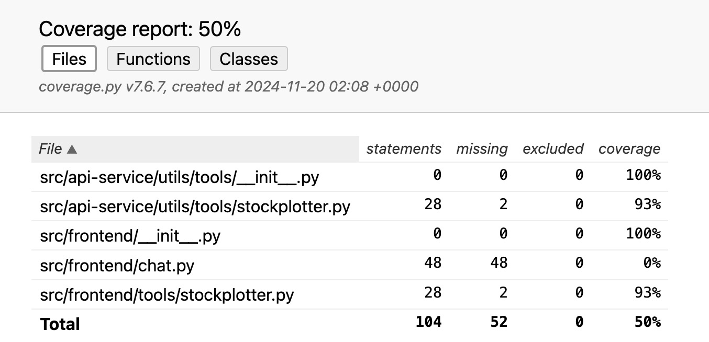

# AC215 - Billionaire Secretary

**Team Members:** Huandong Chang, Mingyuan Ma, Lance Lu, April Zhang

**Group Name:** Billionaires

**Project:** In this project, we aim to develop a platform that automatically connects to a financial database, scrapes data from various online sources, provides analytical and visualization tools, and allows for natural language querying through a chatbot interface. This project aims to reduce the rigidity and repetition in traditional data analysis workflows by providing a more dynamic and automated approach to financial data processing and visualization.

## Milestone2
In this milestone, we implement the components for data management and versioning, model finetuning, and agents.

### Data
Our data is [reddit_finance_43_250k](https://huggingface.co/datasets/winddude/reddit_finance_43_250k), a collection of 250k post/comment pairs from 43 financial, investing and crypto subreddits. Post must have all been text, with a length of 250 chars, and a positive score. Each subreddit is narrowed down to the 70th qunatile before being mergered with their top 3 comments and than the other subs. Further score-based methods are used to select the top 250k post/comment pairs. We stored this 680MB dataset in a private Google Cloud Bucket under the `raw/` folder as `top.jsonl`.

### Containers
Our Dockerfiles all follow the standard convention. Run the containers for each component with `sh docker-shell.sh`. For the gemini-finertuner container, Windows users may need to run `bash docker-shell.sh` instead.

### Data Pipeline
Under **`src/datapipeline`:**
1. **`dataloader.py`:** downloads raw/processed data from the Google Cloud Bucket. Use a command line argument to specify the folder to download from. For example, running `python dataloader.py raw` will download the raw `raw/top.jsonl` file, and running `python dataloader.py reddit_500` will download the processed train and test sets `reddit_500/train.jsonl` and `reddit_500/test.jsonl` totaling 500 rows if they already exist in the bucket.
2. **`preprocess.py`:** process the raw `top.jsonl` file to produce new train and test sets locally. Use a command line argument to specify the sample size. For example, running `python preprocess.py 500` will locally generate new train and test sets `train.jsonl` and `test.jsonl` totaling 500 rows.
3. **`upload.py`:** uploads the local train and test sets into the Google Cloud Bucket. For example, running `python upload.py reddit_500` will upload the local `train.jsonl` and `test.jsonl` files into the `reddit_500` folder in the bucket.

## Milestone4
### Application Design Document

### Front end
Inside `\src\api-service`, run `sh docker-shell.sh` to launch the backend API host. Then, inside `src\frontend`, run `sh docker-shell.sh` to launch the frontend host. The frontend will be running at [http://localhost:8501](http://localhost:8501).

### Continuous Integration Setup
CI is triggered on every push or pull request to the milestone4_CI_test branch.
Steps:
- Check out the code.
- Set up Docker Buildx and cache layers for efficiency.
- Install Docker Compose and build images.
- Start Docker containers using docker-compose.
- Wait for services to initialize.
- Set up Python and install dependencies using Pipenv.
- Run flake8 for linting (optional, can be enabled).
- Execute integration tests using pytest with coverage reporting.
- Upload the test coverage report.
- Tear down Docker containers after tests.

Secrets Management
The `API_KEY` is securely managed through GitHub Secrets. It is automatically injected into the environment during CI.

### Test Documentation:
The tests are written using `PyTest`. For developers to replicate test results locally, run `sh docker-shell.sh` in the root directory and find the coverage report in `htmlcov/index.html`.

## Milestone5
### ML Workflow
ML Workflow allows users to to conduct data collection, data processing, and model finetuning with a single click. Under src/workflow, run `bash docker-shell.sh` and then run `python cli.py` to start the ml workflow.

## Known Issues and Limitations
### User Interface (UI)
- The current UI lacks certain user-friendly features such as:
  - A detailed user manual.
  - Chat history functionality.
- Improvements in these areas are needed to enhance user experience.

### External API Integration
- Institutions are hesitant to share their APIs and data directly with OpenAI.
- A secure and reliable mechanism for integrating external APIs is required to build trust and ensure seamless interoperability.

### Limited Functionalities
- The tool currently does not include:
  - A dashboard for data visualization.
  - Tools for portfolio return tracking.
- Expanding these features will improve the tool's versatility and usability.